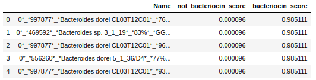

## Welcome
This repository is for my PyTorch reimplementation of my bacteriocin classifier developed during my Master's Thesis. You can find the old implementation [here](https://github.com/lassebuurrasmussen/bacteriocin_classifier/).

#### You can access my paper [here](paper/thesis.pdf).

#### To run my classifier
For this you have two options:
##### 1) Run in Google Colab
You can use [this notebook](bacteriocin_classifier_colab.ipynb) in Google Colab to do the embedding and classification on a free GPU. Just follow the notebook instructions and you will be on your way.
##### 2) Run locally
If you are using this classifier for a smaller data set or you have sufficient hardware available you can run it locally. For this, you will need to install a few dependencies. In the example below I clone this git and create a new conda environment:
```
git clone https://github.com/lassebuurrasmussen/bacteriocin_classifier_v2.0
cd bacteriocin_classifier_v2.0
conda env create -yn bacteriocin_classifier -f environment.yml
conda activate bacteriocin_classifier
```
The last line activates the newly installed environment.

To obtain the parameters of the embedding and classification model do:\
```python download_weights.py # make sure you ran the `cd bacteriocin_classifier_v2.0` command so that the files are placed properly```

Now, to run the model on the fasta in file the [sample_fasta.faa](sample_fasta.faa) and put results in `results.csv` you can do:\
`python main.py -f sample_fasta.faa -o results.csv`

And the output will be of the form:\


Enjoy!